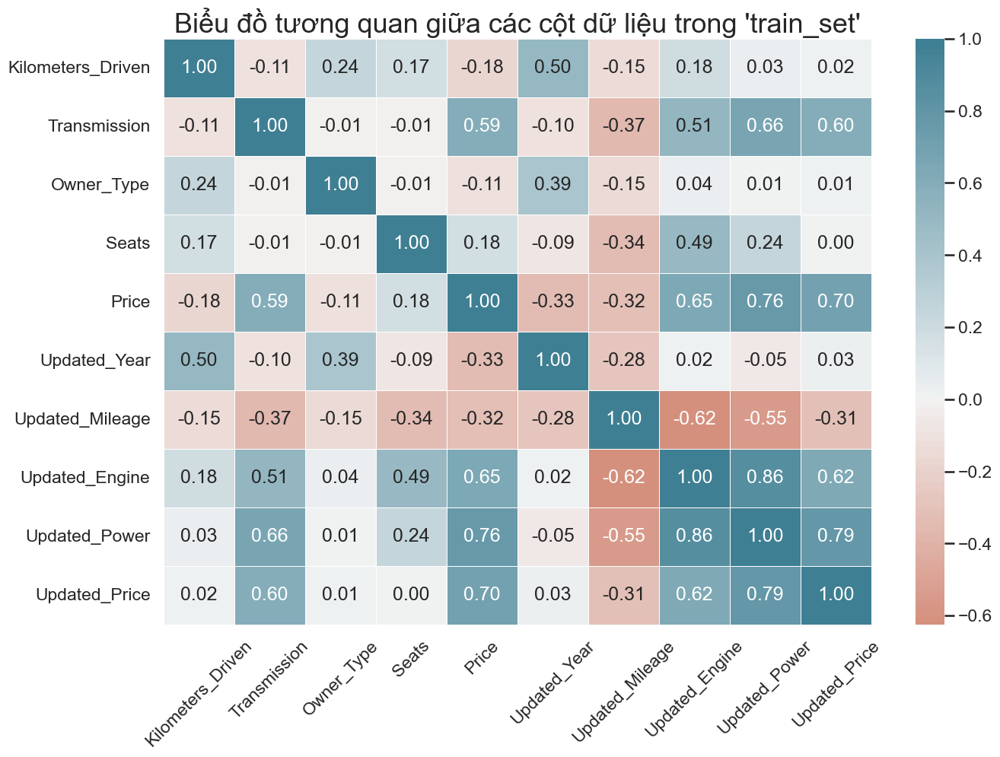

# Bài tập phân tích dữ liệu 
## Khai báo các thư viện cần thiết cho bài toán
```python 
# Libraries
import pandas as pd
import numpy as np
import matplotlib.pyplot as plt
import matplotlib.style as style
%matplotlib inline
import seaborn as sns

# Models
from sklearn.neighbors import KNeighborsRegressor
from sklearn.linear_model import LinearRegression
from sklearn.ensemble import RandomForestRegressor
from sklearn.tree  import DecisionTreeRegressor

# Scoring
from sklearn.metrics import mean_squared_error
from sklearn.metrics import mean_absolute_error
from sklearn.metrics import r2_score
```
## Mô tả bộ dữ liệu
```python 
# Đọc dữ liệu từ file .csv
df = pd.read_csv('./dataset/old-car-data.csv')
```
```python 
df.sample(5)
```

| Name                                      | Location    | Year | Kilometers_Driven | Fuel_Type | Transmission | Owner_Type | Mileage     | Engine  | Power       | Seats | New_Price    | Price |
|-------------------------------------------|-------------|------|--------------------|-----------|--------------|------------|-------------|---------|-------------|-------|--------------|-------|
| Honda City i-VTEC S                       | Jaipur      | 2010 | 48689              | Petrol    | Manual       | First      | 17.4 kmpl   | 1497 CC | 117.3 bhp   | 5.0   | NaN          | 3.87  |
| Toyota Innova Crysta 2.8 ZX AT            | Coimbatore  | 2019 | 40674              | Diesel    | Automatic    | First      | 11.36 kmpl  | 2755 CC | 171.5 bhp   | 7.0   | 28.05 Lakh   | 24.82 |
| Hyundai i10 Era                           | Ahmedabad   | 2012 | 60000              | Petrol    | Manual       | Second     | 19.81 kmpl  | 1086 CC | 68.05 bhp   | 5.0   | NaN          | 2.65  |
| Skoda Superb Style 1.8 TSI AT             | Hyderabad   | 2017 | 26000              | Petrol    | Automatic    | First      | 14.67 kmpl  | 1798 CC | 177.46 bhp  | 5.0   | 33.58 Lakh   | 26.00 |
| Audi Q7 3.0 TDI Quattro Premium Plus      | Delhi       | 2014 | 58000              | Diesel    | Automatic    | First      | 12.07 kmpl  | 2967 CC | 241.4 bhp   | 7.0   | NaN          | 32.00 |

```python
df.shape
```
```
(6019, 14)
```
```python 
df.info()
```
```
<class 'pandas.core.frame.DataFrame'>
RangeIndex: 6019 entries, 0 to 6018
Data columns (total 14 columns):
 #   Column             Non-Null Count  Dtype  
---  ------             --------------  -----  
 0   Unnamed: 0         6019 non-null   int64  
 1   Name               6019 non-null   object 
 2   Location           6019 non-null   object 
 3   Year               6019 non-null   int64  
 4   Kilometers_Driven  6019 non-null   int64  
 5   Fuel_Type          6019 non-null   object 
 6   Transmission       6019 non-null   object 
 7   Owner_Type         6019 non-null   object 
 8   Mileage            6017 non-null   object 
 9   Engine             5983 non-null   object 
 10  Power              5983 non-null   object 
 11  Seats              5977 non-null   float64
 12  New_Price          824 non-null    object 
 13  Price              6019 non-null   float64
dtypes: float64(2), int64(3), object(9)
memory usage: 658.5+ KB
```
```python
df.describe()
```
| Statistic | Unnamed: 0 | Year     | Kilometers_Driven | Seats  | Price     |
|-----------|------------|----------|--------------------|--------|-----------|
| count     | 6019.000   | 6019.000 | 6.019000e+03       | 5977.000 | 6019.000  |
| mean      | 3009.000   | 2013.358 | 5.873838e+04       | 5.278735 | 9.479468  |
| std       | 1737.680   | 3.270    | 9.126884e+04       | 0.808840 | 11.187917 |
| min       | 0.000      | 1998.000 | 1.710000e+02       | 0.000000 | 0.440000  |
| 25%       | 1504.500   | 2011.000 | 3.400000e+04       | 5.000000 | 3.500000  |
| 50%       | 3009.000   | 2014.000 | 5.300000e+04       | 5.000000 | 5.640000  |
| 75%       | 4513.500   | 2016.000 | 7.300000e+04       | 5.000000 | 9.950000  |
| max       | 6018.000   | 2019.000 | 6.500000e+06       | 10.000000 | 160.000000 |

```python 
# Hiển thị thông tin về % số lượng dữ liệu khuyết thiếu

# Tính % dữ liệu khuyết thiếu
miss_percent = (df.isnull().sum() / len(df)) * 100 

# Tạo bảng hiển thị thông tin về % số lượng dữ liệu khuyết thiếu
missing = pd.DataFrame({"percent":miss_percent, 'count':df.isnull().sum()}).sort_values(by="percent", ascending=False)
missing.loc[missing['percent'] > 0]
```
| Attribute   | Percent (%) | Count |
|-------------|-------------|-------|
| New_Price   | 86.310018   | 5195  |
| Seats       | 0.697790    | 42    |
| Engine      | 0.598106    | 36    |
| Power       | 0.598106    | 36    |
| Mileage     | 0.033228    | 2     |

## Tiền xử lý dữ liệu
```python 
# Bỏ cột số thứ tự (cột không tên đầu tiên trong file data)
df.drop(df.columns[0], axis=1, inplace=True)
```
```python 
# Lấy ra tên xe và tạo thành cột "Brand" từ chữ đầu tiên trong cột "Name"
df['Brand'] = df['Name'].apply(lambda x: str(x).split(" ")[0])
```
```python  
# Chuyển năm sản xuất xe thành tuổi đời của xe
import datetime
now = datetime.datetime.now()
df['Updated_Year'] = df['Year'].apply(lambda x : now.year - x)
```
```python 
# Loại bỏ đơn vị đo lường ở các cột "Mileage", "Engine", "Power" và "New_Price"
df['Updated_Mileage'] = df['Mileage'].apply(lambda x: str(x).split()[0])
df['Updated_Engine'] = df['Engine'].apply(lambda x: str(x).split()[0])
df['Updated_Power'] = df['Power'].apply(lambda x: str(x).split()[0])
df['Updated_Price'] = df['New_Price'].apply(lambda x: str(x).split()[0])
```
```python 
# Chuyển các cột vừa update về đơn vị 'float'
df['Updated_Mileage'] = pd.to_numeric(df['Updated_Mileage'], errors='coerce')
df['Updated_Engine'] = pd.to_numeric(df['Updated_Engine'], errors='coerce')
df['Updated_Power'] = pd.to_numeric(df['Updated_Power'], errors='coerce')
df['Updated_Price'] = pd.to_numeric(df['Updated_Price'], errors='coerce')
```
```python 
# Loại bỏ các cột cũ
df.drop(columns=['Name', 'Mileage', 'Engine', 'Power', 'New_Price', 'Year'], inplace=True)
```
```python 
# Tạo phương thức thay dữ liệu khuyết thiếu của cột bất kỳ dựa theo theo hãng "Brand", sử dũng mốt (dữ liệu xuất hiện nhiều nhất)
def replaceMissingData(data, col): 
    data[col] = data[col].fillna(0)
    # Lấy ra tên của tất cả các hãng có dữ liệu bị khuyết thiếu ở một cột bất kỳ
    total_brands = data.loc[(data[col].isnull()) | (data[col] == 0.0) | (data[col] == 'null')]['Brand'].unique();
    for brand in total_brands:
        # Lấy mốt của một cột bất kỳ từ các bản ghi dữ liệu có cùng hãng
        modeData = data.loc[data['Brand'] == brand][col].mode()
        if modeData.size > 0:
            replaced = modeData[0]
            # Lấy ra các bản ghi dữ liệu có cùng hãng mà bị khuyết thiếu dữ liệu ở cột đang xét
            rows = ((data['Brand'] == brand) & ((data[col].isnull()) | (data[col] == 0.0) | (data[col] == 'null')))
            # Tiến hành thay thế dữ liệu khuyết thiếu
            data.loc[rows, col] = replaced
```
```python 
# Thay thế dữ liệu khuyết thiếu cho các cột "Seats", "Updated_Mileage", "Updated_Engine" và "Updated_Power" (trừ cột "Updated_Price" vì khuyết thiếu một lượng lớn dữ liệu ~86%)
replaceMissingData(df, 'Seats')
replaceMissingData(df, 'Updated_Mileage')
replaceMissingData(df, 'Updated_Engine')
replaceMissingData(df, 'Updated_Power')
```
```python 
df.sample(5)
```
| Location     | Kilometers_Driven | Fuel_Type | Transmission | Owner_Type | Seats | Price | Brand       | Updated_Year | Updated_Mileage | Updated_Engine | Updated_Power | Updated_Price |
|--------------|--------------------|-----------|--------------|------------|-------|-------|-------------|--------------|-----------------|----------------|---------------|---------------|
| Hyderabad    | 50000             | Petrol    | Manual       | First      | 5.0   | 3.00  | Maruti      | 11           | 17.50           | 1298.0         | 85.80         | NaN           |
| Bangalore    | 62000             | Petrol    | Manual       | First      | 5.0   | 5.35  | Volkswagen  | 9            | 16.47           | 1198.0         | 74.00         | NaN           |
| Pune         | 50000             | Petrol    | Automatic    | First      | 5.0   | 3.90  | Maruti      | 8            | 23.10           | 998.0          | 67.04         | NaN           |
| Coimbatore   | 48624             | Petrol    | Manual       | First      | 5.0   | 3.22  | Maruti      | 12           | 24.07           | 998.0          | 67.10         | 4.7           |
| Hyderabad    | 24300             | Petrol    | Automatic    | First      | 5.0   | 4.55  | Maruti      | 9            | 23.10           | 998.0          | 67.04         | NaN           |

```python 
# Kiểm tra lại thông tin về % số lượng dữ liệu khuyết thiếu sau khi thực hiện thay thế dữ liệu khuyết thiếu
miss_percent = (df.isnull().sum() / len(df)) * 100 
missing = pd.DataFrame({"percent":miss_percent, 'count':df.isnull().sum()}).sort_values(by="percent", ascending=False)
missing.loc[missing['percent'] > 0]
```
|       | Percent (%) | Count |
|-----------------|-------------|-------|
| Updated_Price   | 86.310018   | 5195  |

```python 
# Xử lý dữ liệu ngoại lai (outlier) cho các cột "Kilometers_Driven", "Seats", "Updated_Mileage", "Updated_Engine" và "Updated_Power"
from scipy import stats
z_score = 3;
threshold = (
    (np.abs(stats.zscore(df['Kilometers_Driven'])) < z_score) &
    (np.abs(stats.zscore(df['Seats'])) < z_score) &
    (np.abs(stats.zscore(df['Updated_Mileage'])) < z_score) &
    (np.abs(stats.zscore(df['Updated_Engine'])) < z_score) &
    (np.abs(stats.zscore(df['Updated_Power'])) < z_score)
)
df = df[threshold]
```
```python 
# Tạo biến dummies với các cột "Location", "Brand" và "Fuel_Type"

#Location
df_location = df[['Location']]
df_location = pd.get_dummies(df_location, drop_first=True)

#Brand
df_brand = df[['Brand']]
df_brand = pd.get_dummies(df_brand, drop_first=True)

#Fuel_Type
df_fuel = df[['Fuel_Type']]
df_fuel = pd.get_dummies(df_fuel, drop_first=True)
```
```python 
# Gán nhãn (label) cho các cột "Transmission" và "Owner_Type"

#Transmission
df.replace({"Manual": 0, "Automatic": 1}, inplace=True)

#Owner_Type
df.replace({"First": 1, "Second": 2, "Third": 3, "Fourth & Above": 4}, inplace=True)
```
```python 
# Gộp set lại sau khi đã xử lý dữ liệu và loại bỏ các cột cũ trước khi xử lý dữ liệu
train_set = pd.concat([df, df_location, df_fuel, df_brand], axis=1)
train_set.drop(["Location", "Fuel_Type", "Brand", "Updated_Price"], axis=1, inplace=True) # Không gộp cột "Updated_Price" (tương ứng với "New_Price") vì khuyết thiếu quá nhiều dữ liệu
train_set.head()
```
| Kilometers_Driven | Transmission | Owner_Type | Seats | Price  | Updated_Year | Updated_Mileage | Updated_Engine | Updated_Power | Location_Bangalore | ... | Brand_Mini | Brand_Mitsubishi | Brand_Nissan | Brand_Porsche | Brand_Renault | Brand_Skoda | Brand_Tata | Brand_Toyota | Brand_Volkswagen | Brand_Volvo |
|--------------------|--------------|------------|-------|--------|--------------|-----------------|----------------|---------------|--------------------|-----|------------|------------------|--------------|---------------|---------------|-------------|------------|--------------|------------------|-------------|
| 72000             | 0            | 1          | 5.0   | 1.75   | 13           | 26.60           | 998.0          | 58.16         | 0                  | ... | 0          | 0                | 0            | 0             | 0             | 0           | 0          | 0            | 0                | 0           |
| 41000             | 0            | 1          | 5.0   | 12.50  | 8            | 19.67           | 1582.0         | 126.20        | 0                  | ... | 0          | 0                | 0            | 0             | 0             | 0           | 0          | 0            | 0                | 0           |
| 46000             | 0            | 1          | 5.0   | 4.50   | 12           | 18.20           | 1199.0         | 88.70         | 0                  | ... | 0          | 0                | 0            | 0             | 0             | 0           | 0          | 0            | 0                | 0           |
| 87000             | 0            | 1          | 7.0   | 6.00   | 11           | 20.77           | 1248.0         | 88.76         | 0                  | ... | 0          | 0                | 0            | 0             | 0             | 0           | 0          | 0            | 0                | 0           |
| 40670             | 1            | 2          | 5.0   | 17.74  | 10           | 15.20           | 1968.0         | 140.80        | 0                  | ... | 0          | 0                | 0            | 0             | 0             | 0           | 0          | 0            | 0                | 0           |

```python 
# Xây dựng biểu đồ tương quan (Heatmap) giữa các cột dữ liệu của dataset được sử dụng để huấn luyện
style.use('ggplot')
sns.set_style('whitegrid')
sns.set_context('talk')
plt.subplots(figsize = (15,10))
sns.heatmap(df.corr(numeric_only=True), cmap=sns.diverging_palette(20, 220, n=200), annot=True, fmt=".2f", linewidths=.5, center = 0)
plt.title("Biểu đồ tương quan giữa các cột dữ liệu trong 'train_set'", fontsize = 26)
plt.xticks(rotation=45);
```
